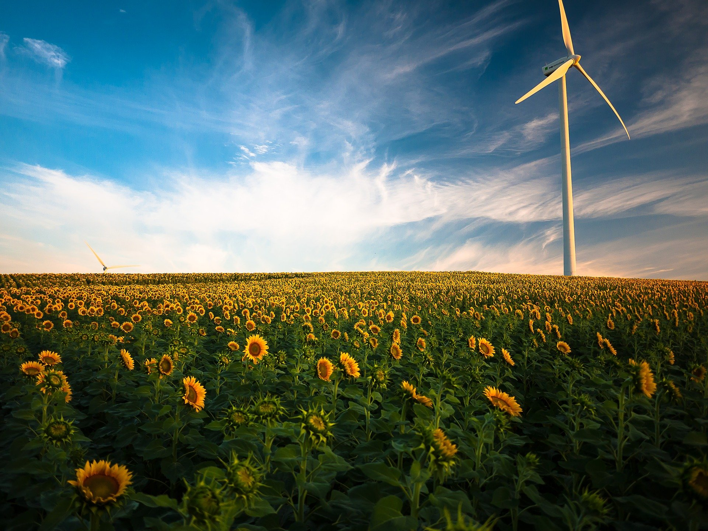

###### **\[INFO : ANNULATION COVID]**

### Journée lancement d'Agrinum

Le projet Agrinum porté par la MFR d'Azay-le-Rideau préfigure un centre d’innovation collaborative pour l’agriculture, à 25km de Tours. Il s’inspire du mouvement des FabLabs, encourage l’innovation ouverte et le partage des savoirs et savoirs-faire. Cet espace collaboratif ouvert et hybride a pour objectif de faciliter la rencontre entre des acteurs hétérogènes pour de nouvelles dynamiques économiques et sociales sur le territoire.

##### En savoir plus :

* [projet agrinum](https://mfr-azay.fr/la-mfr-epicentre-collaboratif-dinnovation-agricole)