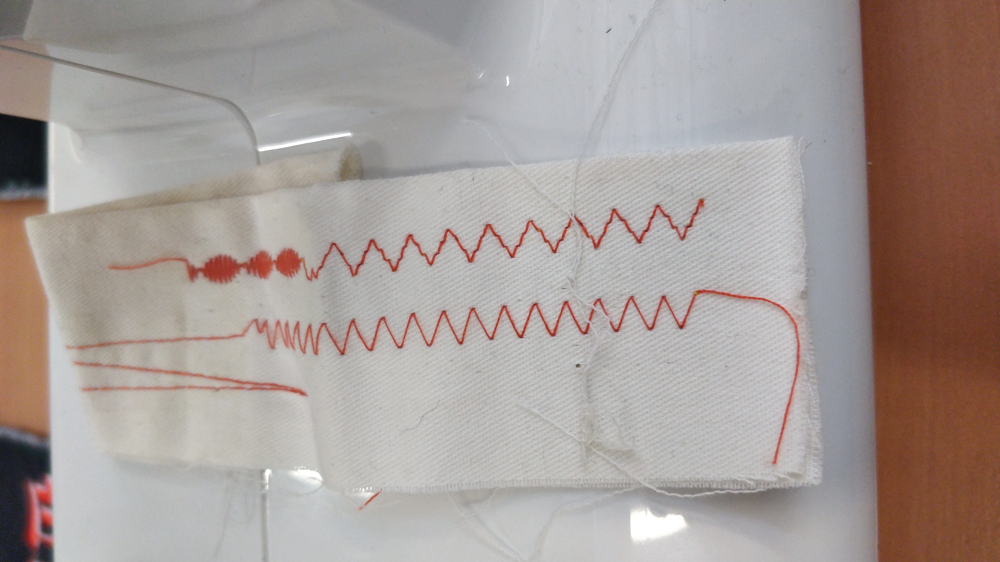

### "Cultiver la terre, produire en ville et à la campagne, vivre les transitions"

Une nouvelle série de parcours en partenariat avec l'Ecole de la 2e Chance Val de Loire et la MFR d'Azay-le-Rideau mettra en lien culture maker et économie circulaire en milieu urbain et rural. 

Les ateliers aborderont des problématiques telles que la gestion, préservation et revalorisation des ressources, le lien au territoire et à la terre, les cultures low tech ou encore la production et la fabrication en circuit-court.

#### 1ère session du 28 septembre au 1er octobre : couture upcycling avec le collectif Lifghtfriday !

