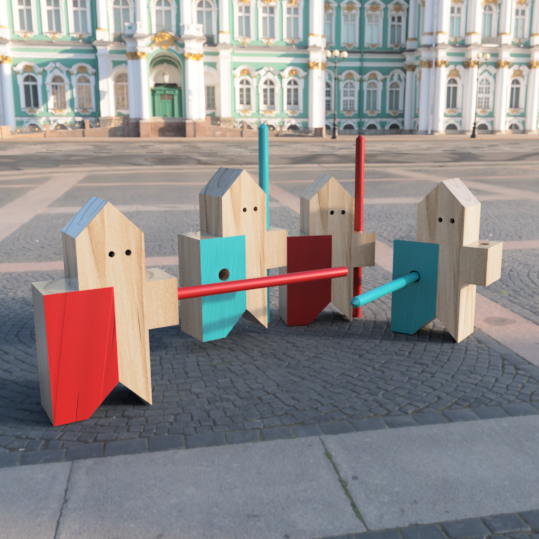

## « Modélisation et impression 3D »

Ce cours s’adresse à un public de débutant qui désire découvrir de façon ludique et conviviale les fondamentaux de la modélisation 3D. Fusion 360 est un logiciel que nous pratiquerons car il propose une approche simplifiée et intuitive de la modélisation paramétrique et surfacique. L’interface du logiciel, ses différentes fonctions, propose un espace de travail accessible au plus grand nombre et permet une progression des  apprentissages de manière régulière et constante.  

### Séance #1, le 28 septembre : CULTURES NUMÉRIQUES

Découverte du fablab, démonstration d’impression 3D et présentation de réalisations - Installation et prise en main du logiciel.

### Séance #2 et 3, le 12 octobre et le 9 novembre 2021 : DU 2D AU 3D LES FONDAMENTAUX

Présentation des spécificités du logiciel et de ces atouts - Découverte de l’espace de travail des outils et des fonctionnalités de bases et principales - La modélisation paramétrique par l’utilisation des outils d’esquisse dans un plan, d’extrusion, de rotation, etc. - Construction de volumes simples ou de petits objets fonctionnels en vue d’une impression 3D  

### Séance #4 et 5, le 23 novembre et le 7 décembre 2021 : MODÉLISER POUR L’IMPRESSION 3D

Les fonctionnalités plus élaborées comme la modélisation en maniant des courbes et des surfaces pour obtenir des pièces aux formes plus complexes et organiques.  

### Séance #6 et 7, le 4 et le 18 janvier 2022 : MODÉLISATION D’UN PROJET PERSONNEL

Formation aux étapes du traitement des fichiers pour l’impression 3D - Réalisation et suivi d’un projet personnel et impression 3D

##### Informations pratiques :

* Mardi de 18 h 00 à 20 h 00 avec Carole Simonet
* 7 séances réparties entre le 28 septembre et le 18 janvier 2022
* tarifs, inscriptions sur le site de l'école supérieure d'art et de design [Talm-Tours](https://esad-talm.fr/fr/les-cours-publics/talm-tours-cours-publics)

*Prérequis : utilisation courante de l’ordinateur et bonne connaissance des fonctions alimentaires d’un ordinateur*