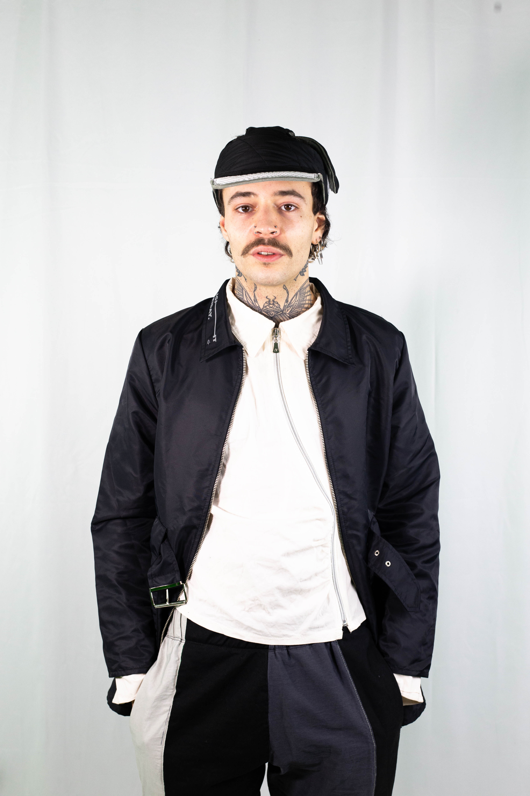
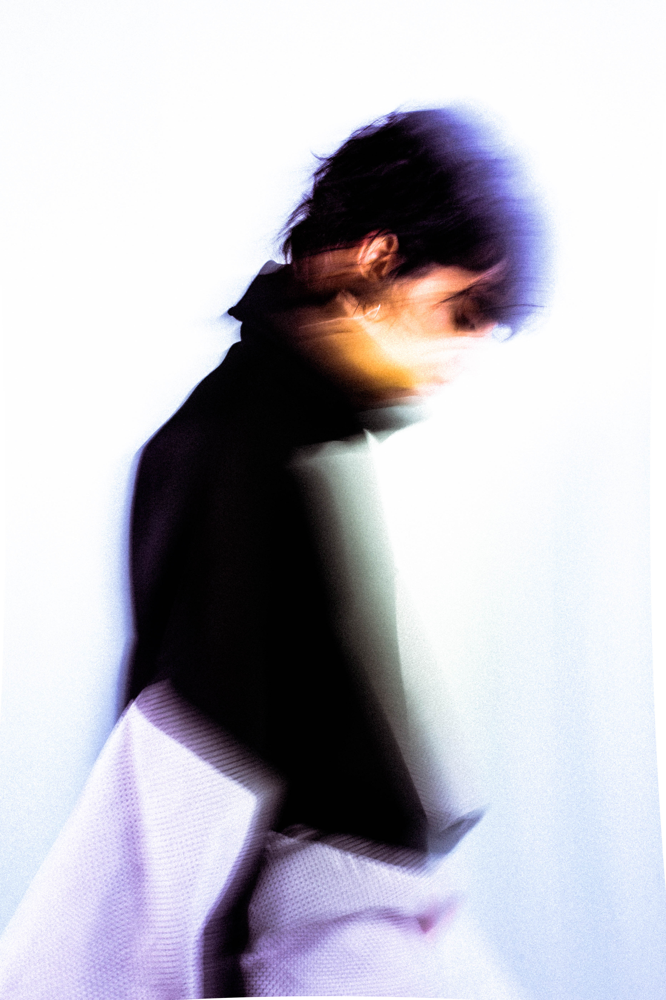

## Stage couture upcycling

La FUN invite le collectif [Lightfriday](https://www.lightfriday.com/) pour un workshop couture upcycling au Funlab avec les jeunes de l'École de la 2ème Chance Val de Loire.

Lightfriday ou LF est un collectif constitués de jeunes artistes qui se manifeste dans le recyclage textile mais aussi dans l’impression et la production d’imagerie. Lightfriday oeuvre dans une éthique de production durable sans distinction de genre ou de style. 
Chaque pièce LF est unique, réalisée à Tours en France et conçue avec des matériaux issus de partenariats comme la Croix Rouge, Active (et d’autres) ou grâce à des dons d’entreprises.

\[Dans le cadre du parcours fablab solidaire de la Fondation Orange]

