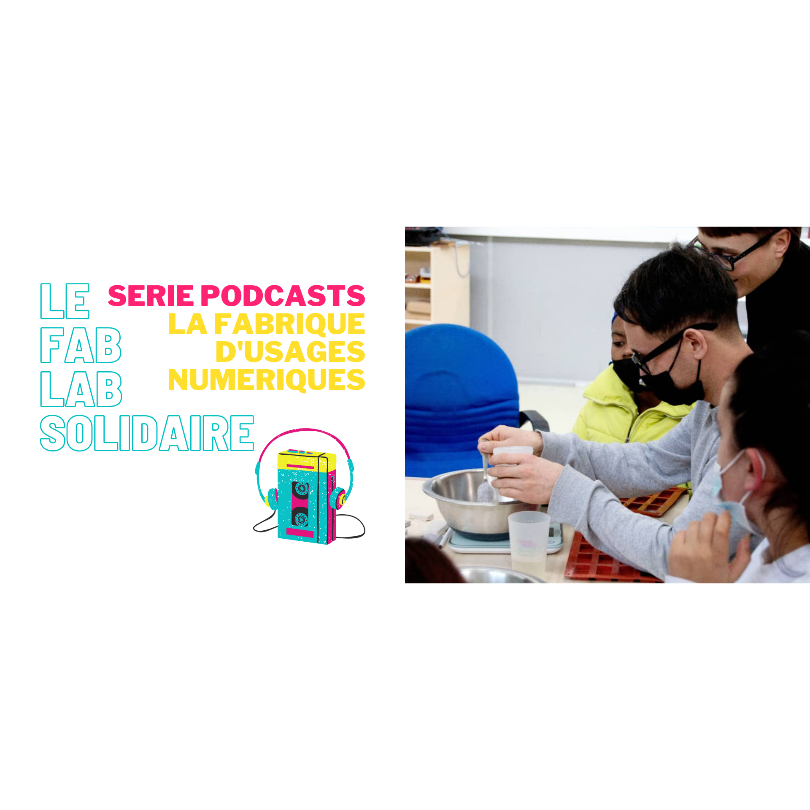

Les stagiaires de l'@e2cvaldeloire ont pu s'initier à la création de matériaux à partir de déchets alimentaires (coquilles de moules et coquilles d'oeufs), l'occasion de cuisiner et tester des recettes de la plateforme [precious.kitchen](https://precious.kitchen/)

##### 📻  A écouter :

* le podcast [épisode 6](https://tube.futuretic.fr/w/uBQDw6Q3HR1dxMWXVHEh3G) réalisé lors du stage
* la série podcast [Fablab solidaire](https://soundcloud.com/user-247009848-888108272/sets/le-fablab-solidaire?si=bd1f1bc1c03544dba1a9d860888ae327&utm_source=clipboard&utm_medium=text&utm_campaign=social_sharing) (reportages audios de 3 à 7 min environ)

"Fablab solidaire" est un programme éducatif de la Fondation Orange.