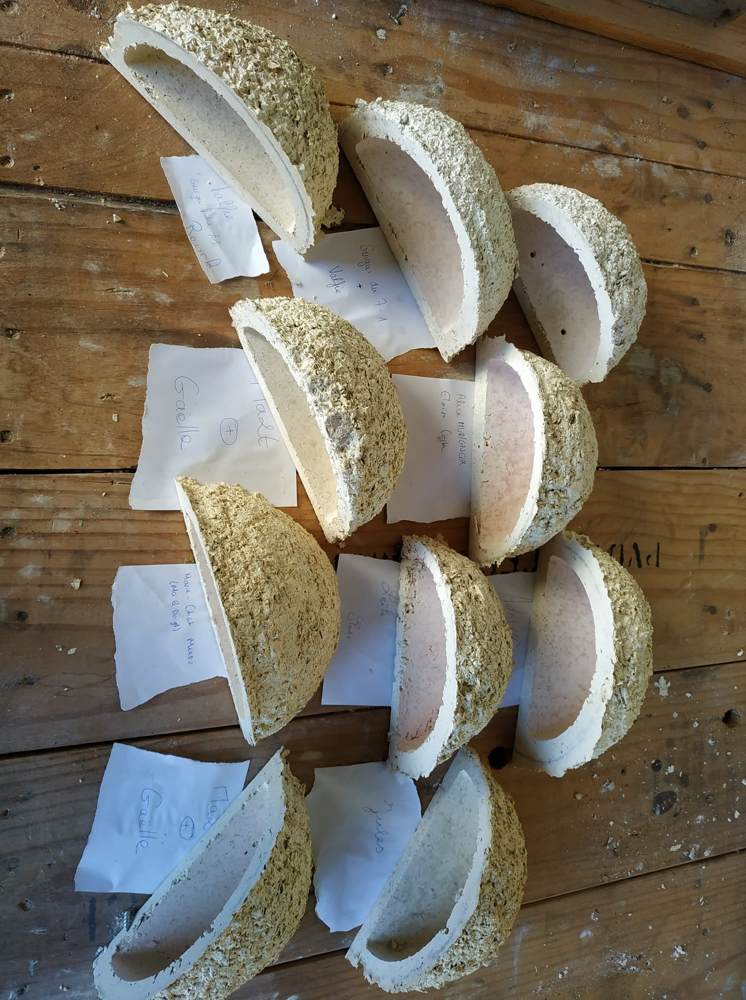
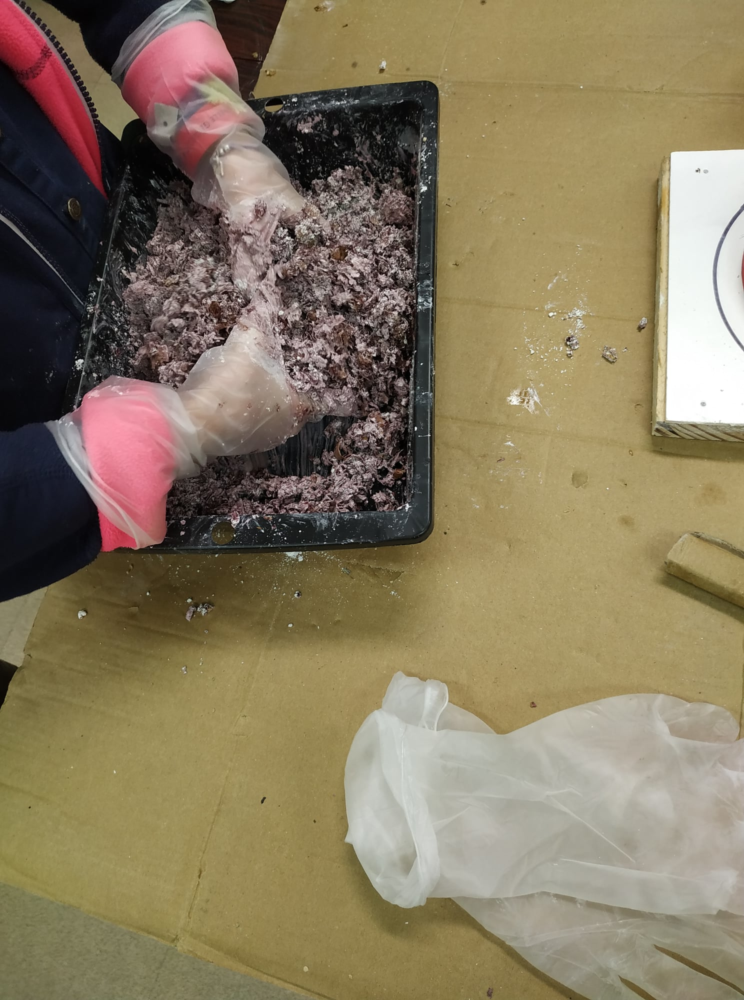
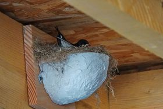

## Atelier fabrication de nichoirs à hirondelles

### Animé par la LPO Centre-Val de Loire

#### Jeudi 17.02.22 de 14h à 17h

Espèces protégées emblématiques de nos printemps, les hirondelles rustiques parcourent chaque année des milliers de km pour revenir se reproduire chez nous. De moins en moins nombreuses au fil des années, elles doivent faire face à de nombreuses menaces et sont notamment victimes de la raréfaction de leur site de nidification.

Pour leur venir en aide, la [LPO](https://www.lpotouraine.fr/) vous invite à participer à un atelier de fabrication de nichoirs à hirondelles rustiques. Ces derniers seront faits grâce à des moules imprimés en 3D et du béton de bois.

###### Informations pratiques :

* A partir de 8 ans
* Inscriptions par mail à : association@lafun.fr
* Matériel : prévoir un tablier

###### En savoir plus sur la Ligue de Protection des Oiseaux : 
* site de la [LPO](https://www.lpotouraine.fr/)
* page facebook de la [LPO](https://www.facebook.com/LPO-Touraine-707021036035030)

*(crédit photos 1&2 : Baptiste Boulay)*

*(crédit photo 3 : Maurice Remond)*