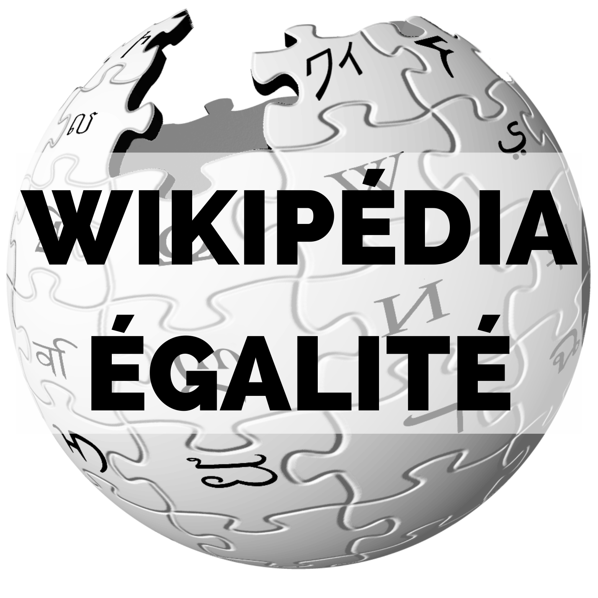

## Femmes tourangelles

### Atelier wikipédia

##### Samedi 19.03.22 (9h30-17h)

Venez contribuer à l'encyclopédie collaborative en l'enrichissant de nouvelles notices consacrées à des femmes tourangelles restées injustement dans l'ombre, à partir de sources disponibles aux archives.

###### Contenu :

Présentation de Wikipédia, formation sur l’élaboration des notices, puis présentation des femmes tourangelles avant de se lancer dans l'élaboration des notices.

*En partenariat avec [H/F Centre Val-de-Loire](https://www.facebook.com/HFCVL) et [Osez le Féminisme 37](https://www.facebook.com/OsezLeFeminisme37/)*

###### Informations pratiques

* Inscription par le formulaire de contact sur le site des [archives d'Indre-et-Loire](https://archives.touraine.fr/page/nouveau-contribuez-a-l-encyclopedie-wikipedia-en-atelier-le-samedi-19-mars)
* Adresse : 6 rue des Ursulines, 37000 Tours
* Horaires : 9h30-12h / 14h-17h

