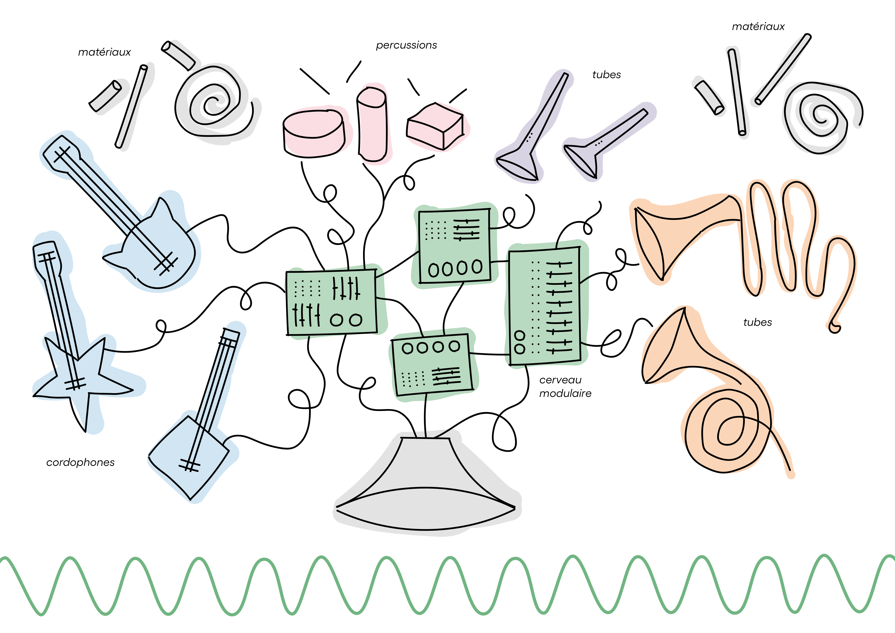

### Le musicien Pierre Lambla en résidence au Funlab du 01 au 03.02.22

La FUN accueille Pierre Lambla pour son projet d'instrumentarium "l'Orchestre Moduli Varius". La fabrication de cet instrumentarium fera appel aux machines à commandes numériques du Funlab. Au cœur du dispositif musical se situera, un synthétiseur modulaire, pensé sur mesure pour les enfants et les néophytes.

*(crédit image : association L'Upito)*

Ce projet artistique et pédagogique porté par l'association L'Upito, permettra également de créer des interactions avec son application "Gears", un logiciel de composition musicale.

#### En savoir + :

* sur l'association L'Upito et l'application [Gears](https://lupito.net/gears)