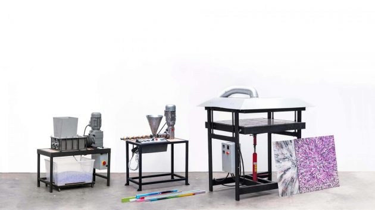

**Durant ce stage, les jeunes de l'E2C Centre Val-de-Loire et de la MFR d'Azay-le-Rideau pourront découvrir [Precious Plastic Touraine](https://preciousplastictouraine.fr/ "https\://preciousplastictouraine.fr/").** Visite de l'atelier, découverte de l'association et découverte des machines qui permettront de broyer, extruder, presser... le plastique pour ensuite fabriquer de nouveaux objets du quotidien ou du mobilier. 

[Precious Plastic](https://preciousplastic.com/ "https\://preciousplastic.com/") est un mouvement international né à l'initiative du designer hollandais Dave Hakkens, visant à rendre accessible à tous le recyclage du plastique.