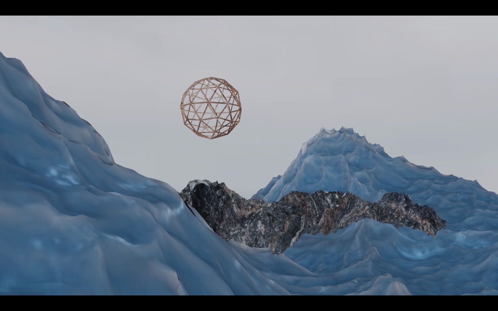

# Initiation "Aux abords du paysage numérique"

## Séance #3 : les shaders

*(crédits image : Solène Charton, "Ailleurs est ici", capture d'écran de la vidéo, 2020)*

Pour appréhender la modélisation et les logiques de l’espace 3D,
ces initiations viseront à fabriquer un paysage artificiel sur le logiciel Blender. 

##### Contenu de la séance : 
* présentation des outils de la fenêtre « shading »,réglages basiques de couleur et de lumière, en démonstration
* temps pratique,aide et conseils au cas par cas.

##### Infos pratiques :

* Ouvert à tou.te.s les adhérent.e.s de La F.U.N
* Apporter son ordinateur personnel au lab ou annoncer le besoin de prêt
* Inscriptions par mail à : association@lafun.fr 
* Prix libre