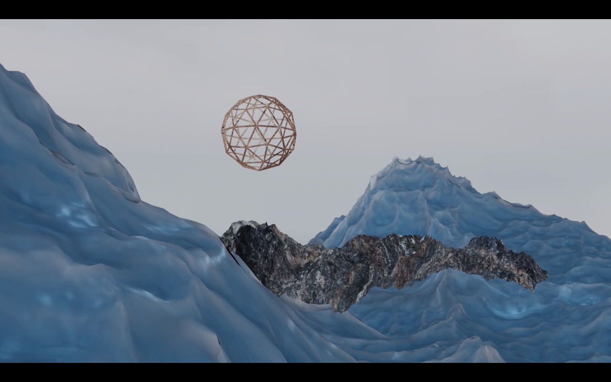

# Initiation "Aux abords du paysage numérique"

## Séance #4 : lumière et tracking caméra

*(crédits image : Solène Charton, "Ailleurs est ici", capture d'écran de la vidéo, 2020)*

Pour appréhender la modélisation et les logiques de l’espace 3D,
ces initiations viseront à fabriquer un paysage artificiel sur le logiciel Blender. 

##### Contenu de la séance : 
* présentation des différents types d’éclairage et de leurs
réglages, en démonstration
* présentation de la vue caméra, de ses réglages et de son déplacement, en démonstration
* temps pratique, aide et conseils au cas par cas
* introduction à l’export, réglages et moteurs graphiques, en démonstration
* exports des « photographies » des paysages produits, présentation collective

##### Infos pratiques :

* Ouvert à tou.te.s les adhérent.e.s de La F.U.N
* Apporter son ordinateur personnel au lab ou annoncer le besoin de prêt
* Inscriptions par mail à : association@lafun.fr 
* Prix libre