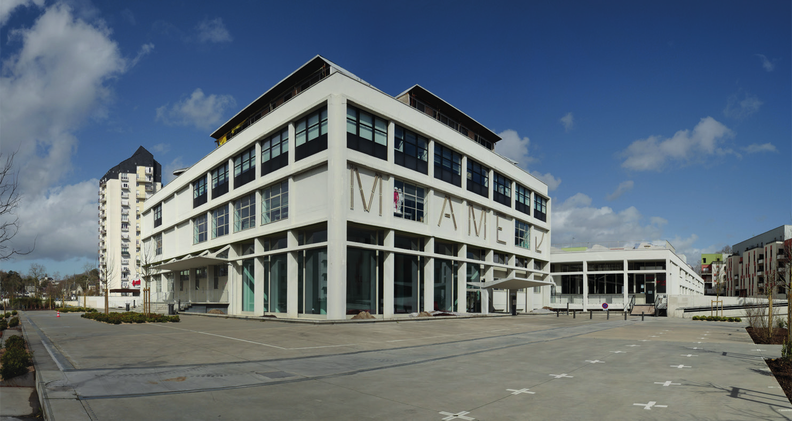

# Venez nous raconter "votre" imprimerie MAME

## 21 avril 2022 à partir de 15h00

*A l'occasion du projet de mise en valeur de l'histoire
de l'ancienne imprimerie MAME, la Mission Val de Loire & la Fabrique d'Usages Numériques vous invitent à un café/goûter*

### Vous avez travaillé dans l'imprimerie MAME, venez nous le raconter !

Vous avez travaillé dans l'imprimerie, venez partager votre expérience autour d'un café/goûter et profitez de cette occasion pour visiter la cité de la création et de l'innovation.

**Deux dates sont proposées :
Les jeudi 22 avril et 19 mai, à partir de 15h00 à MAME, 49 Bd Preuilly.**

L'inscription est obligatoire auprès de la Fabrique d'Usages Numériques par mail ou téléphone :

* association@lafun.fr
* 07 84 66 89 47

