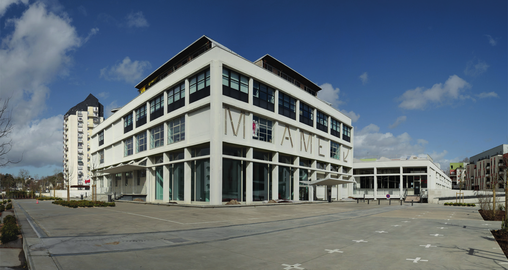

# Venez nous raconter "votre" imprimerie MAME

## Les 21 avril et 19 mai 2022 à partir de 15h00

*A l'occasion du projet de mise en valeur de l'histoire
de l'ancienne imprimerie MAME, la Mission Val de Loire & la Fabrique d'Usages Numériques vous invitent à un café/goûter*

### Vous avez travaillé dans l'imprimerie MAME, venez nous le raconter !

Vous avez travaillé dans l'imprimerie, venez partager votre expérience autour d'un café/goûter et profitez de cette occasion pour visiter la cité de la création et de l'innovation.

**Deux dates sont proposées :
Les jeudi 22 avril et 19 mai, à partir de 15h00 à MAME, 49 Bd Preuilly.**

L'inscription est obligatoire auprès de la Fabrique d'Usages Numériques par mail ou téléphone :

* association@lafun.fr
* 07 84 66 89 47

- - -

L'imprimerie MAME, une mémoire collective :

De 1950 à 2010, l'usine MAME, située 49 boulevard Preuilly,a constitué un exemple remarquable de manufacture contemporaine dédiée à l'imprimerie. Pendant plus d'un demi-siècle s'y sont succédées des générations de spécialistes de toutes les étapes de fabrication du livre, dans un espace conçu pour améliorer leurs conditions de travail (lumière naturelle, décoration
intérieure...).

En 2016, l'ancienne imprimerie MAME est devenue une cité de la création et de l'innovation. Dans le cadre du projet de valorisation de son histoire, la Métropole de Tours, la Mission Val de Loire et la Fabrique des usages numériques proposent d'accueillir les "anciens" de l'imprimerie pour partager leurs histoires.

La mémoire de l’ancienne imprimerie tient autant aux bâtiments qu’aux récits des "anciens".
Encore présente parmi de nombreuses familles de Tours, cette mémoire s’incarne à travers les nombreux récits et souvenirs de celles et ceux qui ont travaillé dans l’imprimerie.