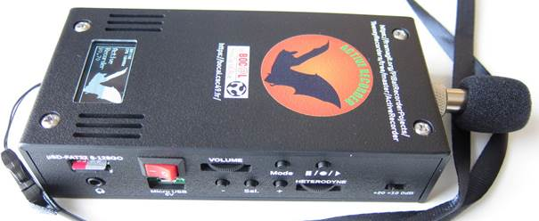

## La FUN accueille la [LPO Touraine](https://www.lpotouraine.fr/) pour des ateliers fabrication de Batbox

### >> jeudi 28 avril 2022

Les chauves-souris vous fascinent et leurs ultrasons encore plus, lancez-vous avec nous en participant à un atelier de fabrication de Batbox (détecteur et enregistreur à ultrasons de chauves-souris) !
Convivial et formateur, vous en apprendrez plus sur les chiroptères et les nouvelles technologies.

**A noter : l'atelier est déjà complet mais quelques places sont encore disponibles pour donner un coup de main (vous pourrez participer mais vous ne pourrez pas repartir avec de batbox).**

### Infos pratiques :

* jeudi 28.04.22 : 18h-21h
* les ateliers sont déjà complet mais il est possible de venir assister et donner un coup de main : envoyez un mail à association@lafun.fr