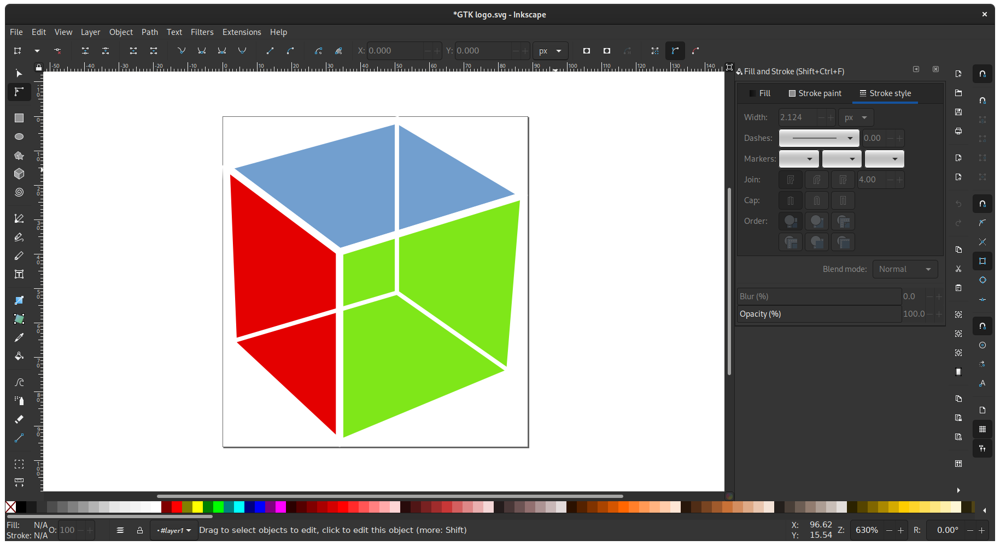

Venez apprendre à utiliser le logiciel de dessin vectoriel Inkscape pour préparer vos fichiers au plotter ou à la découpe laser.

#### Infos pratiques :

* Ouvert à tou.te.s les adhérent.e.s de La FUN
* Inscriptions par mail à asso@lafun.fr
* Prix libre
* Venez avec votre propre ordinateur si possible
