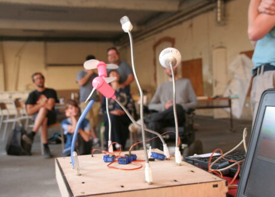

### Événement labellisé HTD - Human Tech Days 2022

#### en partenariat avec [La Labomedia](https://labomedia.org/), avec le soutien de la région Centre Val de Loire.

La FUN participera au festival de la créativité numérique organisé par La Labomedia à Orléans (ateliers, conférences, débats, performances, concerts...).  

Nous co-animerons l'éditathon du vendredi après-midi et participerons à la fête des Zéros Unes le samedi avec une zone fun(print)lab.

##### INFOS PRATIQUES

* programme détaillé [ici](https://labomedia.org/du-20-au-25-juin-2022-semaine-de-la-creation-numerique-fete-de-lalgomusique-fete-zeros-unes/)
* La Labomédia : 108 rue de Bourgogne, 45000 ORLÉANS