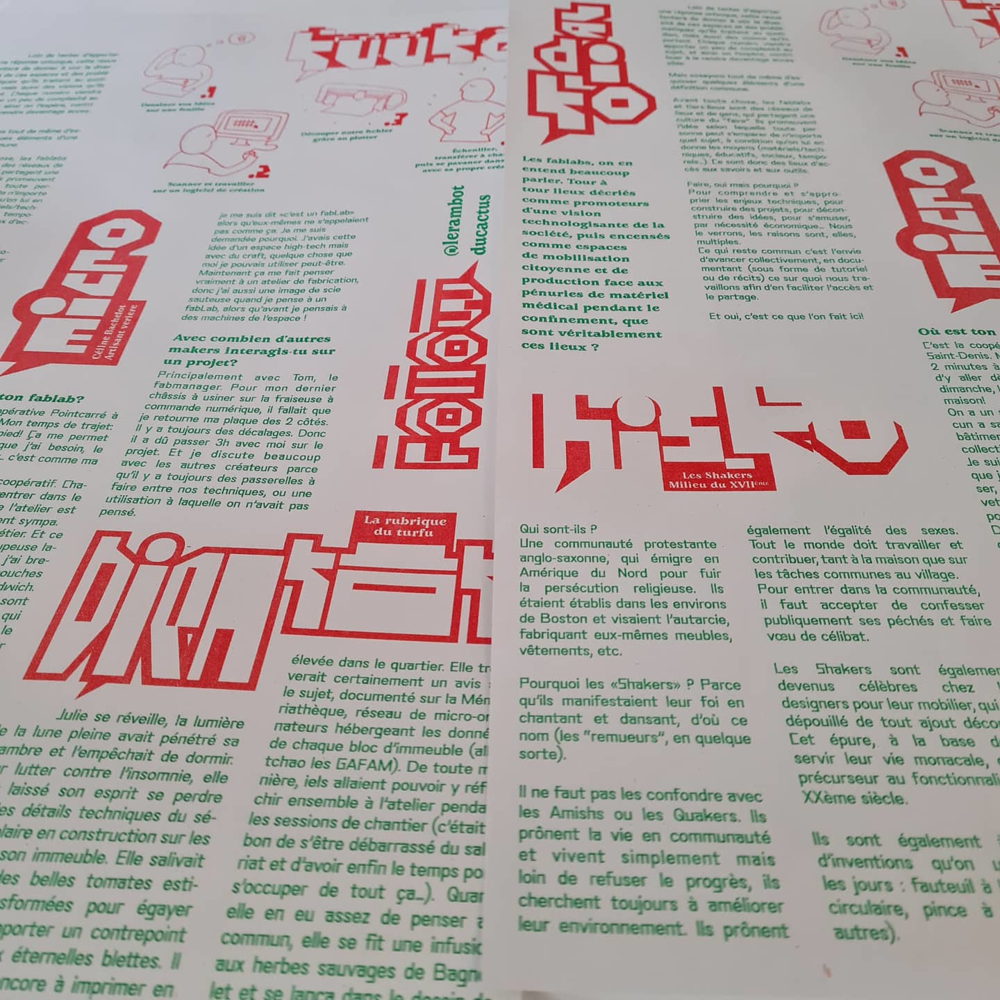

## Labo-fanzine

### dans le cadre du micro-festival "makeHERspace"

**animé par le collectif A3**

A3 est un fanzine née d’une dynamique inter-fablabs en région Île de France. Il se fabrique en itinérance au gré de l’atelier qui l’accueille autour d’une thématique spécifique à chaque numéro. Nous accueillons le collectif A3 au Funlab pour inventer, éditer et imprimer le numéro 5 « makeHERspace » tout au long du festival.
Faisons-le ensemble !

Le jeudi 16 juin, de 18h à 20h nous imprimerons le fanzine avec la riso du Funlab.

#### INFOS PRATIQUES

*Evènement organisé avec le soutien de la Région Centre Val-de-Loire
dans le cadre de Human Tech Days 2022 & des journées portes ouvertes de Mame*

* Gratuit sur inscriptions via le formulaire en ligne [ici](https://framaforms.org/makeherspace-141516-juin-2022-au-funlab-a-tours-1654076994).
* Programme téléchargeable [ici](https://cloud.lafun.fr/apps/files/?dir=/La%20FUN/ACTIVIT%C3%89S/PROJETS/PROJETS%202022/HTD%20LA%20FUN/MAKEherSPACE&fileid=163945)