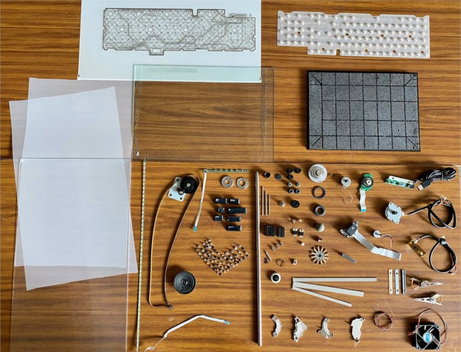

## Atelier d'empowerment numérique

### dans le cadre du micro-festival "makeHERspace"

**animé par Laure Bouscasse**

L’association [Les portes logiques](https://lesporteslogiques.net/) travaille à démocratiser les valeurs et pratiques du numérique libre, en mode “no GAFAM !”.
L’empowerment est un outil utilisé par les féministes pour se réapproprier des savoirs et pratiques auxquelles le patriarcat nous limite l’accès ou nous en a éloigné.

Plongées dans nos ordis, smartphone et autres outils numériques, submergées de
textos, mails et autres communications virtuelles...comment on est avec tout ça ?
Cet atelier propose de démonter du matériel électronique pour explorer ce qu’il y a
dedans. Voyage dans le monde du numérique à grand coup de pied de biche.

#### INFOS PRATIQUES

*Evènement organisé avec le soutien de la Région Centre Val-de-Loire
dans le cadre de Human Tech Days 2022 & des journées portes ouvertes de Mame*

* Gratuit sur inscriptions via le formulaire en ligne [ici](https://framaforms.org/makeherspace-141516-juin-2022-au-funlab-a-tours-1654076994).
* Programme téléchargeable [ici](https://cloud.lafun.fr/apps/files/?dir=/La%20FUN/ACTIVIT%C3%89S/PROJETS/PROJETS%202022/HTD%20LA%20FUN/MAKEherSPACE&fileid=163945)