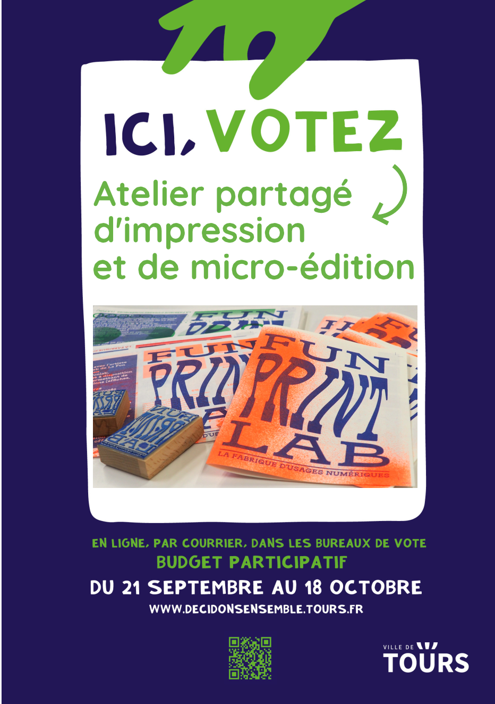

## C’est parti les votes sont ouverts !

Vous avez jusqu'au 18 octobre pour voter. 
Pour apporter votre voix à notre projet d’atelier partagé d’impression et de micro-édition, c’est [ici](https://decidonsensemble.tours.fr/.../budgets/1/projects/15)

#### Le projet déposé par La FUN :

La FUN développer au sein de son atelier partagé (le Funlab) un pôle dédié à l'impression et à la micro-édition permettant à tous de créer soi-même des publications, imprimer local à moindre coût, partager des savoirs autour de l'impression

#### Quand voter ?

Du 21.09.22 au 18.10.22

#### Qui peut voter ?

Toute personne de plus de 11 ans qui habite, étudie ou travaille à Tours.

#### Comment voter ?

En ligne, en bureau de vote ou par voie postale 

#### Toutes les infos sur [decidonsensemble.tours.fr](https://decidonsensemble.tours.fr/)