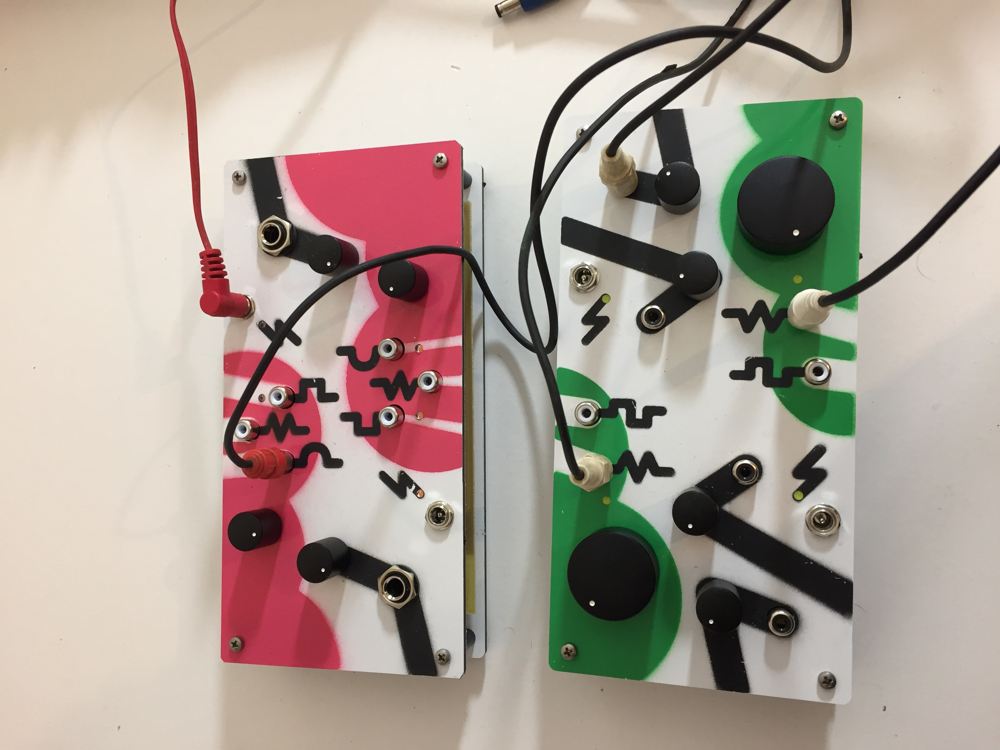
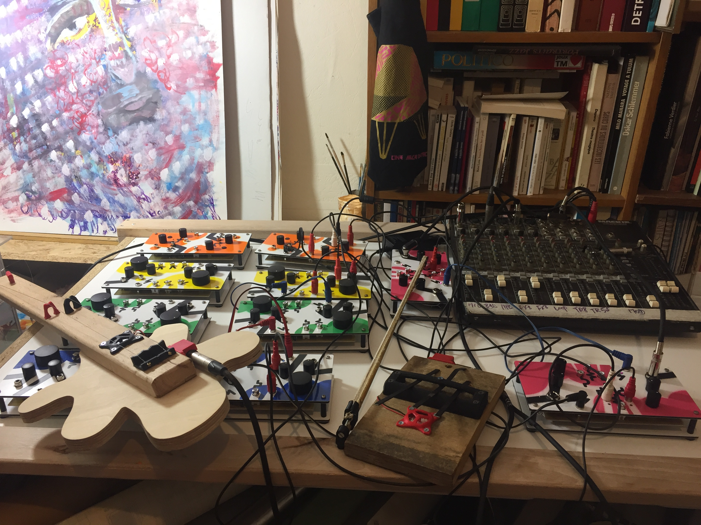
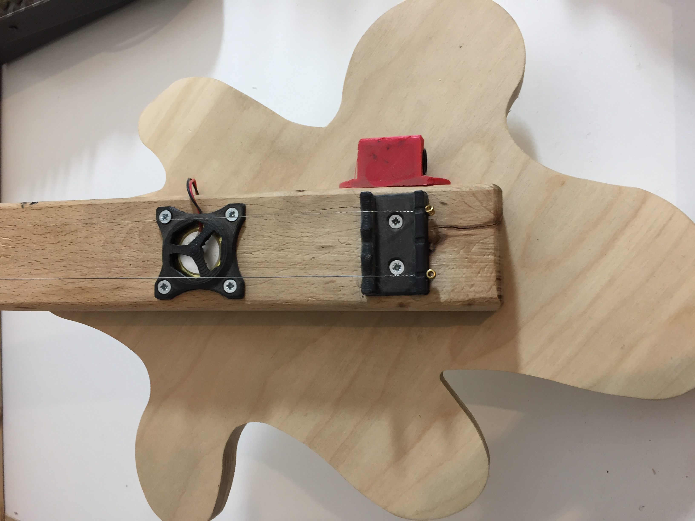

## Deux jours d'activités sonores et de fabrication d'instruments. Animés par Pierre Lambla et Frédéric Mancini.

On profite de la venue de ces deux musiciens au Funlab pour proposer diverses activités : 

* Le mercredi après-midi on accueille un groupe de jeunes (en partenariat avec Le Temps Machine).
* Le Jeudi de 14h à 17h l'atelier est ouvert à toutes et tous, sur réservation dans la limite de 12 places.
* Le jeudi de 18h à 21h, surprise + apéro LABson ouvert à toutes et tous !

##### Infos pratiques :

* inscriptions pour l'atelier du jeudi après-midi sur [fabmanager.lafun.fr](https://fabmanager.lafun.fr/#!/events/76)

(c) photos : Pierre Lambla