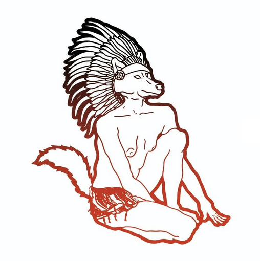

## Funlab & friends

Les 2 et 3 décembre 2022, MAME et l'[Association Germinal - Centre-Val de Loire](https://www.facebook.com/germinalcvdl) organisent l'Autre Marché. 

Le Funlab et sa communauté y participeront, retrouvez : 

### Precious Plastic Touraine :

[Precious Plastic Touraine](https://www.instagram.com/preciousplastictouraine/) est une association qui a pour objectif de réduire la pollution plastique en Touraine au travers de la pédagogie, de la transmission de connaissances et de la production de mobilier design, durable, désirable, à base de déchets plastiques locaux recyclés en circuit court.

PPT vous présentera ses premières productions. De sa réflexion sur le design et les ressources non valorisées du territoire sont nés une horloge, un vide-poche et un tabouret, fabriqués en série limitée et déclinés à partir de la même base modulable. Ces produits minimalistes révèlent la matière plastique sous un nouveau jour et nous invitent à revenir à l'essentiel pour les fêtes de fin d'année. 

### Orw/Elle catalogne :

Alors Orw/Elle catalogne est ravie de vous de vous accueillir 
pour ce marché de la noelle avec des goodies sérigraphiés (mouchoir cartes et culottes), des macules, des cyanotypes, de l'impression artisanale. Mon livre visage c'est Orwelle catalogne.

### Marion Montel :

Broderie contemporaine. Petits formats.
[Marion Montel](https://www.facebook.com/broderiecontemporaine) brode des photos et cartes anciennes, en s’appuyant sur la composition de l’image pour créer des fictions et déplacer le regard. La broderie devient une sorte de dessin  au fil, perçant le support de manière irréversible. Chaque pièce est ainsi unique.

### Matière folle :

[Matière Folle](https://www.facebook.com/matierefolle), association de partage et de transmission des arts créée par Mary Christides, s'est amusée pour ce marché de Noël, à revisiter certains jeux de société de votre enfance pour les détourner et les transformer en beaux objets satiriques et humoristiques.

### Anais Pirin :

Créations en chambre à air upcyclées

### Carmin design :

Illustration brodée sur vêtement de seconde main

### et d'autres ami.es du Funlab...