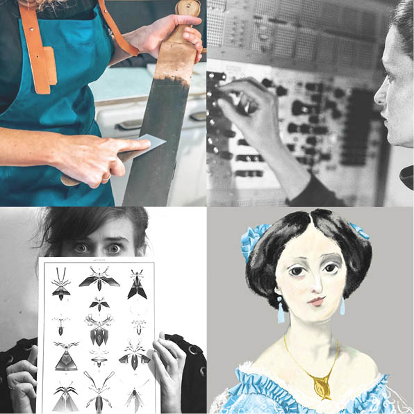

La FUN organise une soirée dans le cadre du festival MakeHerFest*, afin de mettre en lumière plusieurs créatrices accueillies en résidences de production au Funlab cette année.

## Au programme :

### Rencontres · Apéro · Visite de l'atelier

#### Avec des invitées

* Florence Cherrier, création sonore et micro-édition : fanzine sur les femmes pionnières dans les musiques électroniques
* Mary Christides, illustration : production d’un jeu « Qui est-ce ? » autour des Illustres inconnues de Touraine 
* Alexia de Fluff, arts visuels : création d’installations mécaniques et sonores « Les xylophasmes »
* Julie Troncin, maroquinerie : recherche/expérimentation artisanat et numérique

#### Avec l’équipe de La FUN

Présentation de projets portés par l’association : 

* les fanzines Make Her Space (Julie Lallement et Catherine Lenoble)
* collaborations avec des étudiantes de TALM en restauration d’oeuvres d’art (Carol Simonet)

#### et aussi

"Ramène tes sœurs" > adhésions à prix libre ce soir !

#### LE FESTIVAL 
[MakeHerFest](https://www.makeherspace.fr/festival-makeherfest-edition-1/) est un festival initié par le collectif MakeHerSpace. Il met à l’honneur des makeuses, artisanes et fabriqueuses en tout genre via une série d’évènements dans plusieurs villes de France (Paris, Montreuil, Tours, Malakoff...). L’édition #1 se déroulera du 8 au 30 mars 2023 dans différents fablabs et ateliers partagés qui proposeront pour l’occasion des rencontres, workshops, expositions, portes ouvertes ... 
Cet évènement en réseau fait suite à l’édition #0 du festival MakeHerSpace initié à Tours au Funlab en juin 2022.*

###### EN SAVOIR PLUS :

* [Collectif Make Her Space](https://www.makeherspace.fr/)

###### EN RÉSONANCE :

* Exposition « Illustres inconnues de Touraine » du 03.03.23 au 01.04.23, Bibliothèque centrale, Tours
* Atelier wikipédia « Illustres inconnues de Touraine » le 18.03.23, archives départementales d’Indre-et-Loire, Tours