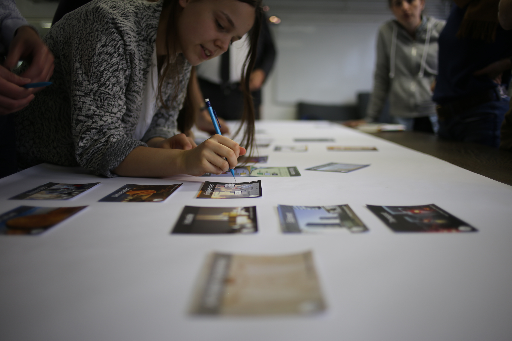

## Atelier scientifique collaboratif

### animé par : Marie Ghekière

La fresque du climat fait appel à la créativité et à l'intelligence collective du groupe pour reconstituer le fonctionnement du système climatique ainsi que les causes et conséquences de son dérèglement. Elle donne une vision d'ensemble de cette vaste problématique et fournit les clés de compréhension pour agir efficacement à son échelle.

###### Infos pratiques :

* Gratuit
* Inscriptions sur [fabmanager](https://fabmanager.lafun.fr/#!/events/142)