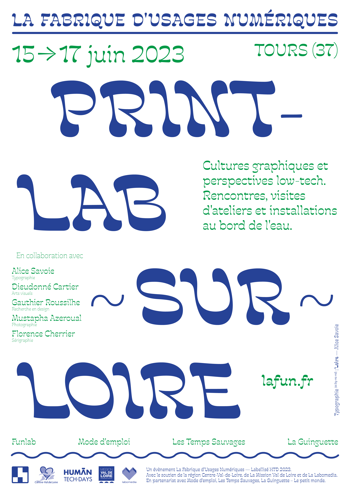

## Au Funlab et hors-les-murs, 3 jours de rencontres, visites d’ateliers, installations au bord de l’eau pour mettre à l’honneur les cultures graphiques déployées dans une perspective low-tech.

**Avec : [Alice Savoie](https://frenchtype.com/) (typographie), [Dieudonné Cartier](http://www.dieudonnécartier.com/) (arts visuels), [Gauthier Roussilhe](https://gauthierroussilhe.com/) (recherche en design), [Mustapha Azeroual](https://azeroualmustapha.com/) (photographie), Florence Cherrier (sérigraphie) et autres invités.**

### Au programme :

#### Le jeudi 15 juin

* 14h-17h → open Atelier typo Loire \[ places limitées ]
  Exploration de déclinaisons graphiques avec les machines du lab et fabrication d'un « kit typo Loire ».
* 17h-18h → restitution publique au Funlab
* 18h-20h → Conférence d'Alice savoieau café sésame
  Rencontre autour de l'histoire de la création de la typo Loire.

#### Le vendredi 16 juin

* 16h → Visite du Funlab : découverte d'un atelier partagéde fabrication numérique et artisanale.
* 17h30 → Visite de l’atelier de Dieudonné Cartier à Mode d'emplo : rencontre autour de son installation Tout s’écoule (Panta rhei), dispositif de reproduction d’images à travers le spectre de l’eau.
* 19h → rencontre avec Gauthier roussilhe à la Librairie Les temps sauvages : Présentation de l'ouvrage Perspectives low-tech (éditions Divergences, mars 2023) co-écrit avec Quentin Mateus (Low-tech Lab).

#### Le samedi 17 juin

* 16h-19h → Print-Party en bord de Loire à la Guinguette : un abécédaire de la typo loire, des tirages réalisés avec un traceur made in Funlab, de la sérigraphie avec Florence Cherrier ou encore l’impression solaire dévoilée par Mustapha Azeroual, venez découvrir des techniques d’impressions low-tech au bord de l’eau.
* 19h-21h → Clôture de l’évènement en musique à la Guinguette

*Evènement labellisé HTD2023 - avec le soutien de la [région Centre Val-de-Loire](https://www.centre-valdeloire.fr/), la [Mission Val de Loire](https://www.valdeloire.org/) et [La Labomedia](https://labomedia.org/)*

*En partenariat avec : la Mission Val de Loire, la librairie [Les temps sauvages](https://lestempssauvages.fr/), [la Guinguette - Le petit monde](https://www.facebook.com/GuinguettedeTours), [Mode d'Emploi](https://mode-demploi.org/)* 

###### Infos pratiques :

* Télécharger le programme avec le plan [ici](https://cloud.lafun.fr/index.php/s/xTG3mcZWEgJ54DK)
* s'inscrire via le formulaire ici