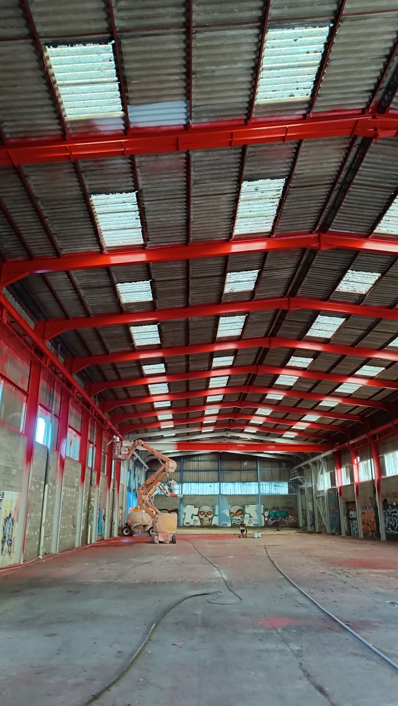
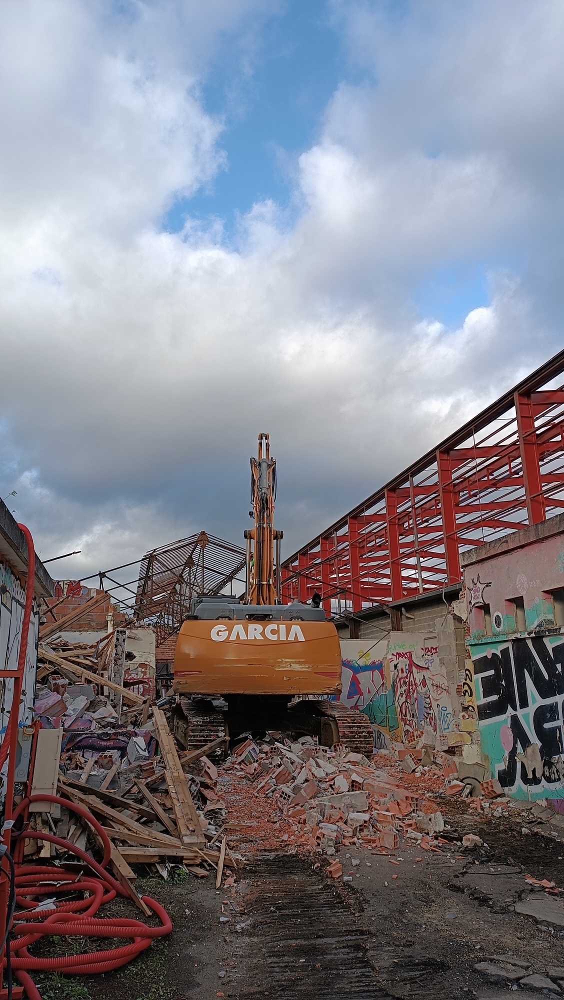
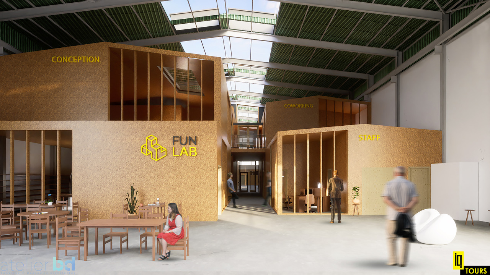
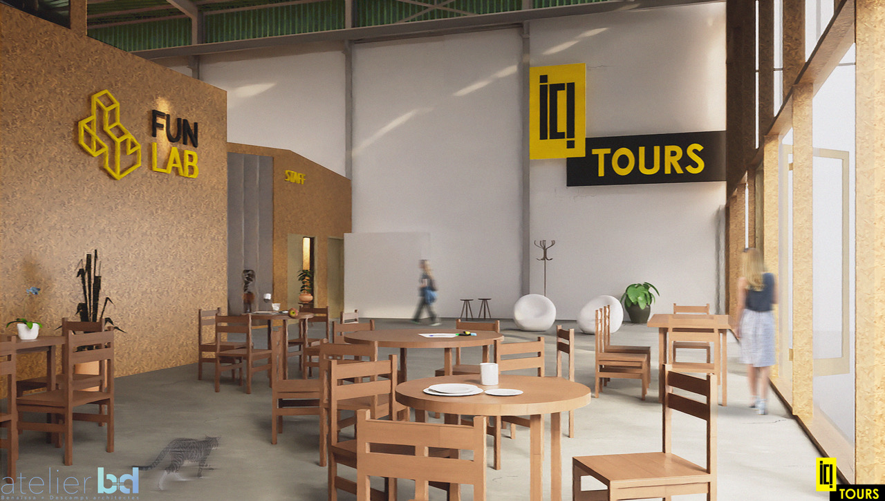
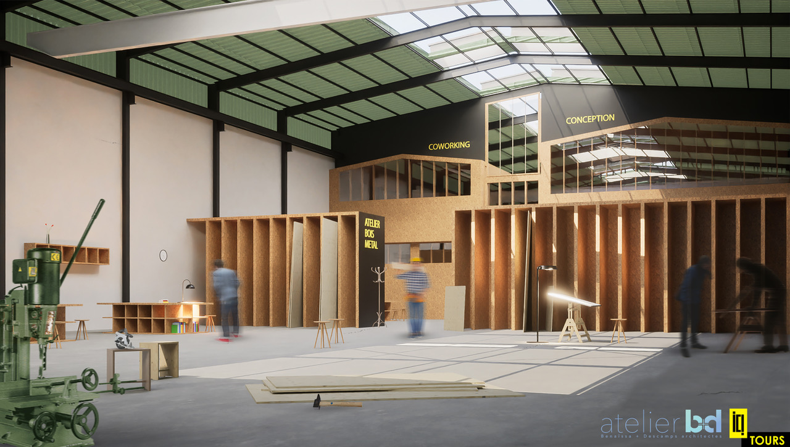
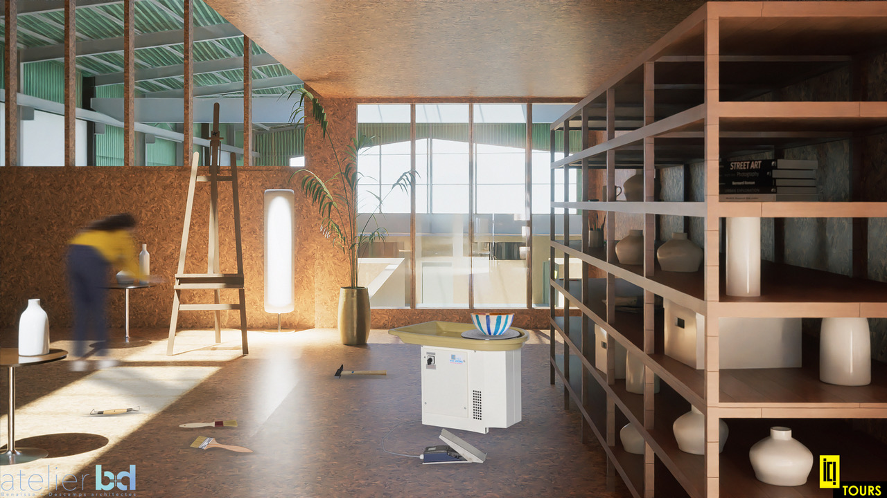

## L'équipe de La FUN vous souhaite une belle année 2024!

#### C'est un nouveau chapitre qui s'ouvre pour nous, avec "La Manufacture Tourangelle" et un chantier réjouissant en perspective : notre nouvel atelier à Saint-Sauveur aux côtés d' ICI Tours !

On en profite pour vous partager des photos des travaux qui avancent à grands pas... Après le nettoyage de la charpente, son éclatante peinture rouge et la phase de démolition/désamiantage, en route pour la pose de la couverture dès ce mois de janvier.

La Halle Gaury sera prête d’ici quelques mois pour accueillir les équipes et usagers du Funlab, ainsi que 60 artisan·es d'art (ébénistes, menuisiers, serruriers, céramistes, tapissiers, stylistes...), designers, artistes, professionnels de la fabrication numériques et TPEs de production locale. Nous partageons aussi quelques vues 3D de l'intérieur du bâtiment, vous donnant un aperçu de ce que sera ce futur lieu tourangeau dédié à la fabrication.

(c) photos et vues 3D by MakeICI