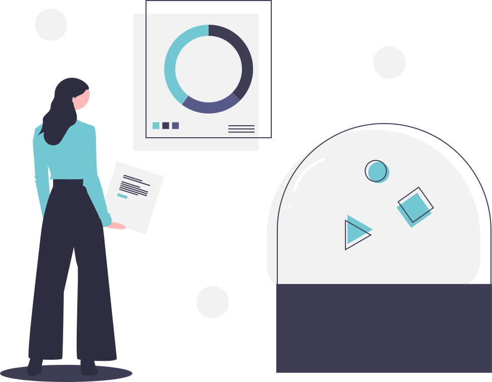

# Des ateliers-laboratoires

### Pour explorer et accompagner des pratiques hybrides (numérique/analogique/artisanal, matériel/immatériel, print/digital ...) autour de la création sonore (LabSon), de la micro-édition (PrintLab) et des sciences participatives ouvertes (BioLab).!

